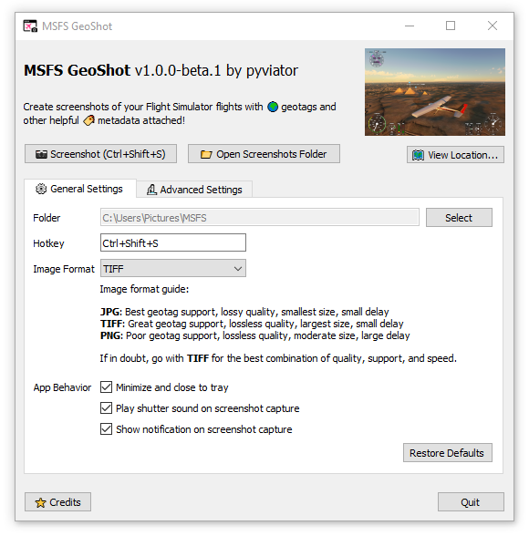
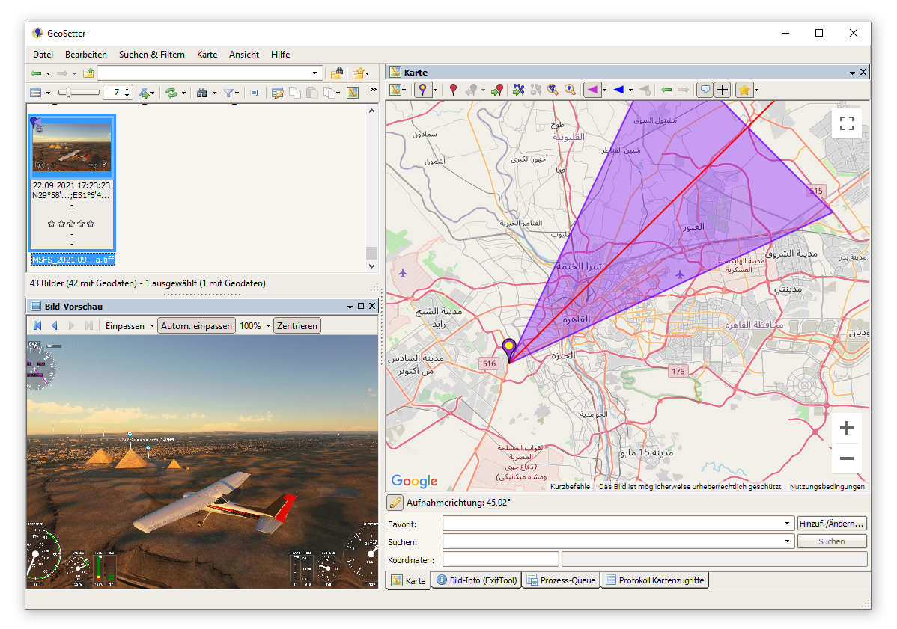
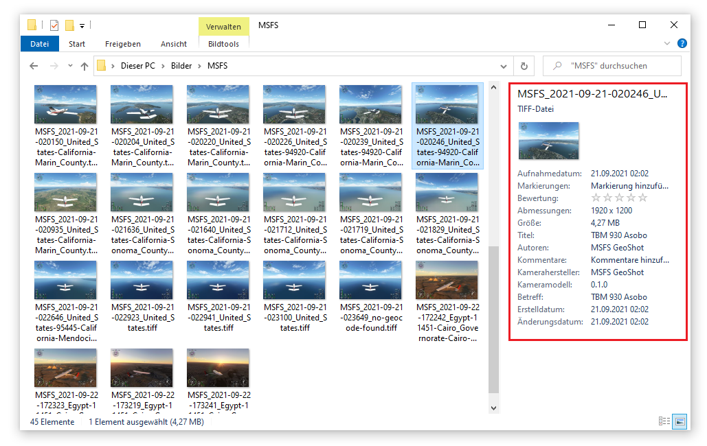
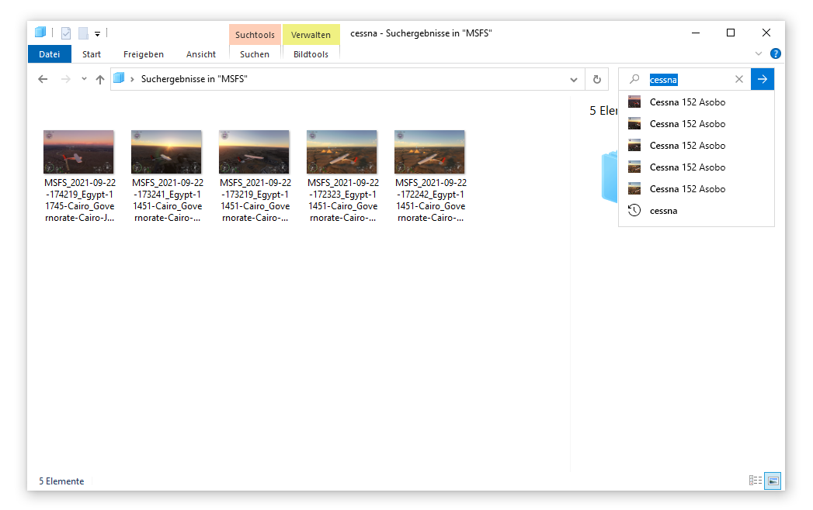

</img>

# MSFS GeoShot

GeoShot is a **screenshot** tool for **Microsoft Flight Simulator**. It allows users to create metadata-enriched screenshots of their flights, enabling use cases such as keeping track of screenshot locations via **geotags**.

## Screenshots

*Interface*

*Screenshots viewed through various external apps and services*
| Geosetter                                                                          | Google My Maps                                                                         |
| ---------------------------------------------------------------------------------- | ----------------------------------------------------------------------------- |
|  | <a href="./assets/gmaps.png"><a> |
|                                                                                    |                                                                               |

| Explorer (detail view)                                                                           | Explorer (search by aircraft)                                                                  |
| ------------------------------------------------------------------------------------------------ | ---------------------------------------------------------------------------------------------- |
|  |  |
|                                                                                                  |                                                                                                |

## Installation and Use

An easy-to-use installer for MSFS GeoShot is available on flightsim.to, where you will also find some simple instructions to get you started (though using the tool should be fairly self-explanatory for the most part).

## Contributing

Contributions are welcome! To get started, please see [CONTRIBUTING](./CONTRIBUTING.md).

## Credits and License

MSFS GeoShot is Copyright (C) 2021 [pyviator](https://github.com/pyviator/).

*Regarding MSFS GeoShot's code*:

This program is free software: you can redistribute it and/or modify it under the terms of the GNU Affero General Public License as published by the Free Software Foundation, either version 3 of the License, or (at your option) any later version.

This program is distributed in the hope that it will be useful, but WITHOUT ANY WARRANTY; without even the implied warranty of MERCHANTABILITY or FITNESS FOR A PARTICULAR PURPOSE. See the GNU Affero General Public License for more details.

*Regarding non-code-files*:

MSFS GeoShot also includes a number of media assets which are licensed under the [CC BY-SA 4.0](https://creativecommons.org/licenses/by-sa/4.0/legalcode). For more information on the exact licensing terms and credits of original works, please see the [media resources README](msfs_geoshot/_resources/README.md).

Additionally, compiled builds of MSFS GeoShot include [Python-SimConnect](https://github.com/odwdinc/Python-SimConnect/) which ships with a bundled version of the SimConnect.dll from Microsoft Flight Simulator's SDK. Microsoft Flight Simulator is © Microsoft Corporation. Any assets from Microsoft Flight Simulator used by MSFS GeoShot (SimConnect.dll) are used under Microsoft's "Game Content Usage Rules". This project is not in any way endorsed by or affiliated with Microsoft.

*Special shout-outs*

MSFS GeoShot is built on the shoulders of giants, with a special shout-out due for the following members of the MSFS community:

*   [odwdinc](https://github.com/odwdinc) for their work on [Python-SimConnect](https://github.com/odwdinc/Python-SimConnect)
*   [Luuk3333](https://github.com/Luuk3333/msfs-screenshot-gps-data) for inspiring this project with [msfs-screenshot-gps-data](https://github.com/Luuk3333/msfs-screenshot-gps-data)

MSFS GeoShot would also not exist without a number of other third-party software in the greater open-source ecosystem. A full overview of all the  dependencies bundled with the program and overview of their copyright statements and licenses may be found in MSFS GeoShot's in-program credits.
